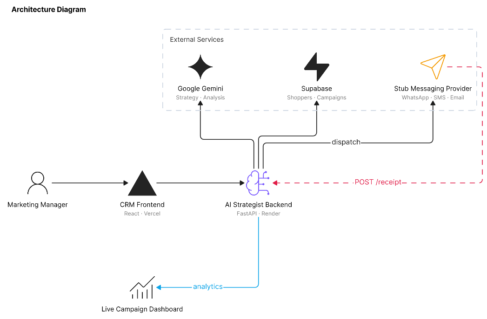
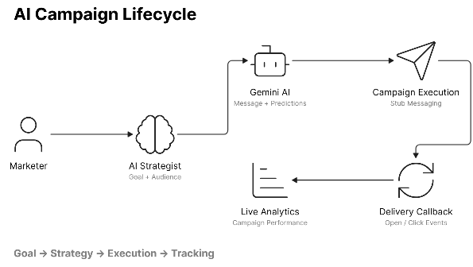

# MiddleStump CRM

**AI-Native Marketing Platform for Intelligent Shopper Engagement**

---

## Live Demo

| Service                | URL                                 |
| ---------------------- | ----------------------------------- |
| Frontend               | https://middlestump-crm.vercel.app/ |
| Backend API            | <insert backend url>                |
| Stub Messaging Service | <insert stub url>                   |

---

## AI-Native Approach

MiddleStump is not a traditional CRM, nor is it a conversational chatbot. It is built from the ground up as an AI-native campaign orchestration engine. 

Instead of manually building audiences and writing copy, marketers simply describe their **business intent**:
- *"Win back inactive customers"*
- *"Increase repeat purchases"*
- *"Promote the new IPL collection"*

**The AI Strategist** (powered by Google Gemini) automatically:
1. Analyzes live business context and aggregate CRM data.
2. Identifies the optimal target audience segments.
3. Generates personalized campaign messaging.
4. Predicts quantitative campaign performance (Reach, CTR, Revenue).
5. Orchestrates execution across designated channels.
6. Analyzes live outcomes against its initial predictions.

The marketer remains the **supervisor**, approving strategies and budgets, while the AI functions as the **operator**, handling campaign design, segmentation, and execution.

---

## Key Features

- **AI Campaign Builder**: Translate plain-text business goals into ready-to-execute campaigns.
- **AI Opportunity Discovery**: Proactively surfaces high-value segments (e.g., churn risk, high value) without manual prompting.
- **Shopper Segmentation**: Robust tagging, filtering, and behavioral grouping.
- **Personalized Messaging**: Dynamic content injection at scale.
- **Campaign Execution**: Asynchronous batching and routing of messages.
- **Callback-Driven Delivery Tracking**: Webhook-based ledger for tracking actual delivery, opens, and conversions.
- **Live Campaign Analytics**: Real-time Recharts dashboards powered by Supabase aggregations.
- **AI Performance Insights**: Post-campaign analysis comparing predicted vs. actual performance.

---

## Architecture



---

## Campaign Workflow



---

## Tech Stack

| Layer | Technologies |
| :--- | :--- |
| **Frontend** | React, Vite, React Query, Tailwind CSS, Recharts, Lucide Icons |
| **Backend** | FastAPI (Python), httpx |
| **Database** | Supabase PostgreSQL |
| **AI Layer** | Google Gemini 2.5 Flash |
| **Infrastructure** | Vercel (Frontend), Render (Backend, Stub Service) |

---

## Strategic Design Decisions

### AI Strategist Instead of Chatbot
We deliberately avoided a standard chatbot interface. Enterprise marketing requires rigorous execution, not conversation. The AI Strategist acts as a decision-support engine that outputs structured JSON strategies (predictive metrics, targeting parameters) rather than conversational prose, enforcing actionable outcomes.

### Callback-Driven Communication Lifecycle
Real-world SMS/WhatsApp providers operate asynchronously. To mirror this, MiddleStump uses an external Stub Messaging Service that receives outbound API requests and subsequently fires webhooks back to our backend to simulate real-world delivery latency and engagement states (Delivered, Opened, Clicked, Converted).

### Dedicated Channel Service
Routing logic and provider integration (`services/channel.py`) are decoupled from core CRM logic. This enables seamless future integration with real providers (Twilio, Gupshup, SendGrid) without refactoring the AI orchestration layer.

### Gemini Resilience Layer
To guarantee uptime despite LLM quota constraints, the backend implements a resilient fallback mechanism:
- **Multi-Key Fallback**: Automatically rotates through a cascade of 3 Gemini API keys upon hitting `429 ResourceExhausted` errors.
- **Retry Handling**: Explicit prompt retries to auto-correct malformed JSON before throwing exceptions.
- **Safe Fallbacks**: Hardcoded deterministic strategies ensure the UI remains functional even during total LLM outages.

### Real-Time Campaign Analytics
Campaign aggregates are updated safely using PostgreSQL RPCs (`increment_campaign_counters`) upon receiving delivery webhooks. This prevents race conditions during high-volume callback spikes and allows the frontend to poll for perfectly accurate live statistics.

### FastAPI Background Task Execution
When a marketer confirms a campaign, the UI immediately returns a `200 OK`. The actual database writes, external HTTP dispatches, and payload formatting run via FastAPI `BackgroundTasks`, preventing UI freezes and ensuring robust asynchronous execution.

### Campaign-First CRM
Traditional CRMs are sprawling directories of contacts. MiddleStump optimizes for **action**. The UI prioritizes campaign generation and live analytics over static CRM administration, ensuring the platform actively drives revenue.

---

## Scale Assumptions & Tradeoffs

**Current Scope:**
- Hundreds of shoppers
- Simulated external channel provider
- FastAPI `BackgroundTasks` for concurrency
- Single database instance

**At Larger Scale (1M+ Users):**
- **Queue-Based Processing**: FastAPI `BackgroundTasks` would be replaced by Celery, Kafka, or AWS SQS to handle durable, high-throughput message dispatching.
- **Distributed Workers**: Dedicated worker nodes for execution and webhook processing.
- **Event-Driven Architecture**: Transitioning from synchronous HTTP external calls to an event-bus architecture.
- **Webhook Authentication**: Adding HMAC signatures to external callbacks to prevent spoofing.

### Database Scaling
- Account-based sharding for tenant isolation
- Read replicas for analytics-heavy workloads
- Redis caching for frequently accessed segments and campaign analytics

---

## API Reference

### AI APIs
- `POST /api/ai/analyze`: Receives business intent, fetches context, and returns a structured AI campaign strategy.
- `GET /api/ai/opportunities`: Proactively queries context and generates 6 data-driven campaign opportunities.
- `POST /api/ai/analyze-campaign/{id}`: Evaluates final campaign results against initial AI predictions.

### Campaign APIs
- `POST /api/ai/confirm`: Transforms an approved AI strategy into pending database communication records and triggers background execution.
- `GET /api/campaigns`: Lists all active/historical campaigns.
- `GET /api/campaigns/{id}`: Fetches real-time aggregate statistics for a specific campaign.
- `GET /api/campaigns/{id}/audience`: Resolves dynamic segment tags into a specific list of targetable shoppers.

### Communication APIs
- `POST /api/communications/receipt`: The webhook endpoint that external providers hit to update delivery status and increment live counters.

---

## AI-Native Development Workflow

MiddleStump was engineered using a deeply AI-assisted development workflow. Rather than blind code generation, LLMs were utilized for:
- **Architecture Planning**: Designing the webhook lifecycle and database schema.
- **Backend Implementation**: Scaffolding FastAPI routes and Supabase integrations.
- **Frontend Development**: Rapidly iterating on Tailwind CSS layouts and Recharts visualizations.
- **Debugging & Refactoring**: Identifying race conditions in database increments and optimizing JSON parsing strategies.

**Every generated component was manually reviewed, integrated, and thoroughly tested.** AI was treated as a collaborative engineering partner rather than an autonomous code generator. All architectural, product, and implementation decisions were validated manually before being incorporated into the final system. This project stands as an example of AI-accelerated product engineering, combining human architectural oversight with AI execution speed.

---

## Repository Structure

```text
middlestump-frontend/
React + Vite frontend application

middlestump-backend/
FastAPI backend, AI orchestration, campaign execution, and analytics

stub-service/
Messaging simulator and callback engine

assets/
Architecture and workflow diagrams
```

---

## Local Setup

### 1. Database (Supabase)
Ensure you have a Supabase project initialized with the required `shoppers`, `campaigns`, and `communications` tables.

### 2. Backend
```bash
cd middlestump-backend
pip install -r requirements.txt
# Configure .env with SUPABASE_URL, SUPABASE_KEY, and GEMINI_API_KEY
uvicorn main:app --reload
```

### 3. Stub Service
*(Requires Node.js)*
```bash
cd stub-service
npm install
node index.js
```

### 4. Frontend
```bash
cd middlestump-frontend
npm install
# Configure .env with VITE_API_BASE_URL
npm run dev
```

---

## Future Improvements

### Account-Based Database Sharding
Implement multi-tenancy and shard customer data by account/tenant ID to support horizontal scaling across thousands of brands.

### Redis / Memcached Caching Layer
Introduce a caching layer to dramatically reduce latency for segment counts, shopper lookups, and static campaign analytics.

### Cassandra Event Store
Shift from a relational database update model to an append-only event store for communication delivery callbacks, optimizing for massive write throughput during high-volume blasts.

### Queue-Based Campaign Processing
Migrate background tasks to Kafka or SQS, ensuring durable, fault-tolerant campaign execution with dead-letter queues.

### Multi-Region Deployment
Deploy API gateways and workers across multiple edge regions to reduce latency for global webhook providers.

### Advanced Delivery Reliability
Implement strict webhook authentication (HMAC validation), automated retry logic for provider timeouts, and guaranteed delivery tracking.
